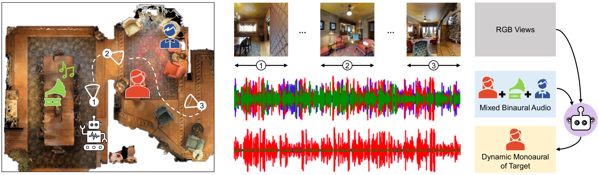

# active-AV-dynamic-separation
Code and datasets for 'Active Audio-Visual Separation of Dynamic Sound Sources' (ECCV 2022).

# Active Audio-Visual Separation of Dynamic Sound Sources
This repository contains the PyTorch implementation of our **ECCV-22 paper** and the associated datasets: 

[Active Audio-Visual Separation of Dynamic Sound Sources](https://vision.cs.utexas.edu/projects/active-av-dynamic-separation)<br />
Sagnik Majumder and Kristen Grauman<br />
The University of Texas at Austin, Meta AI Research

Project website: [https://vision.cs.utexas.edu/projects/active-av-dynamic-separation](https://vision.cs.utexas.edu/projects/active-av-dynamic-separation/)

<p align="center">
  
</p>

## Abstract
We explore active audio-visual separation for dynamic sound sources, where an embodied agent moves intelligently in a 3D environment to continuously isolate the time-varying audio stream being emitted by an object of interest. The agent hears a mixed stream of multiple time-varying audio sources (e.g., multiple people conversing and a band playing music at a noisy party). Given a limited time budget, it needs to extract the target sound using egocentric audio-visual observations. We propose a reinforcement learning agent equipped with a novel transformer memory that learns motion policies to control its camera and microphone to recover the dynamic target audio, using self-attention to make high-quality estimates for current timesteps and also simultaneously improve its past estimates. Using highly realistic acoustic SoundSpaces simulations in real-world scanned Matterport3D environments, we show that our model is able to learn efficient behavior to carry out continuous separation of a time-varying audio target.

## Dependencies
This code has been tested with ```python 3.6.13```, ```habitat-api 0.1.4```, ```habitat-sim 0.1.4``` and ```torch 1.4.0```. Additional python package requirements will be made available in ```requirements.txt```.   
  
First, install the required versions of [habitat-api](https://github.com/facebookresearch/habitat-lab), [habitat-sim](https://github.com/facebookresearch/habitat-sim) and [torch](https://pytorch.org/) inside a [conda](https://www.anaconda.com/) environment. 

Next, install the remaining dependencies either by 
```
pip3 install -r requirements.txt
``` 
or by parsing ```requirements.txt``` to get the names and versions of individual dependencies and install them individually.

## Datasets
Download the project-specific datasets from [this link](https://tinyurl.com/bdd7u83r), extract the tar.gz and put it under the project root. The extracted ```data``` directory should have 3 types of data
1. **audio_data**: the pre-processed and pre-normalized raw monaural audio waveforms for training and evaluation    
2. **passive_datasets**: the dataset (audio source and receiver pair spatial attributes) for pre-training of passive separators    
3. **active_datasets**: the dataset (episode specification) for training of Move2Hear policies   
 
Make a directory named ```sound_spaces``` and place it in the same directory as the one where the project root resides. Download the [SoundSpaces](https://github.com/facebookresearch/sound-spaces/blob/main/soundspaces/README.md) Matterport3D **binaural RIRs** and **metadata**, and extract them into directories named ```sound_spaces/binaural_rirs/mp3d``` and ```sound_spaces/metadata/mp3d```, respectively.    
     
Download the [Matterport3D](https://niessner.github.io/Matterport/) dataset, and cache the observations relevant for the SoundSpaces simulator using [this script](https://github.com/facebookresearch/sound-spaces/blob/main/scripts/cache_observations.py) from the [SoundSpaces repository](https://github.com/facebookresearch/sound-spaces). Use resolutions of ```128 x 128``` for both RGB and depth sensors. Place the cached observations for all scenes (.pkl files) in ```sound_spaces/scene_observations```. Also, copy or symlink the scene directories under ```habitat_data/v1/tasks/mp3d_with_semantics``` of the downloaded MP3D dataset folder, which contain ```.glb```, ```.house```, ```.navmesh``` and ```.ply``` files, in ```data/scene_datasets/mp3d```.
     
For further info about the structuring of the associated datasets, refer to ```audio_separation/config/default.py``` and the task configs.

## Code

## Code
###### Pretraining    
```
CUDA_VISIBLE_DEVICES=0 python3 main.py --exp-config audio_separation/config/pretrain_passive.yaml --model-dir runs/passive_pretrain --run-type train NUM_PROCESSES 1
```
###### Policy Training
```
CUDA_VISIBLE_DEVICES=0,1,2,3,4,5,6,7 python3 -u -m torch.distributed.launch --use_env --nproc_per_node 8 main.py --exp-config audio_separation/config/train/nearTarget.yaml --model-dir runs/active_train/near_target --run-type train NUM_PROCESSES 14
``` 
###### Validation    
First, link checkpoints using ```scripts/search_for_checkpoint_thru_validation/link_ckpts_for_val.ipynb``` to search for best checkpoint on the basis of validation.   
    
Then, run   
```
CUDA_VISIBLE_DEVICES=0 python3 main.py --exp-config audio_separation/config/val/nearTarget.yaml --model-dir runs_val/active/near_target --run-type eval NUM_PROCESSES 1
```   

Search for best checkpoint using ```scripts/search_for_checkpoint_thru_validation/find_bestCkpt_lowestValSTFTLoss.ipynb```.   
     
For unheard sounds, use ```config/val/nearTarget_unheard.yaml``` and use the corresponding validation directory.   

###### Testing        
First, copy the best checkpoint from the search to ```runs_test/active/nearTarget```.  
   
Then, run   
```
CUDA_VISIBLE_DEVICES=0 python3 main.py --exp-config audio_separation/config/test/nearTarget.yaml --model-dir runs_test/active/near_target --run-type eval NUM_PROCESSES 1
```   
    
Compute test metric (STFT l2 loss or SI-SDR) values using ```scripts/separated_audio_quality/compute_separation_qualtiy.ipynb```.      
      
For unheard sounds, use ```config/test/nearTarget_unheard.yaml```, and use the corresponding test directory.

## Model checkpoints
Download model checkpoints from this [link](https://utexas.box.com/shared/static/7jaww6xew54zv1llmfskhsiyuh3lddqx.zip).


## Citation
```
@article{majumder2022active,
    author    = {Majumder, Sagnik and Grauman, Kristen},
    title     = { Active Audio-Visual Separation of Dynamic Sound Sources},
    journal   = {arXiv preprint arXiv:2202.00850},,
    year      = {2022},
}
```

# License
This project is released under the MIT license, as found in the [LICENSE](https://github.com/SAGNIKMJR/active-av-dynamic-separation/blob/main/LICENSE) file.
